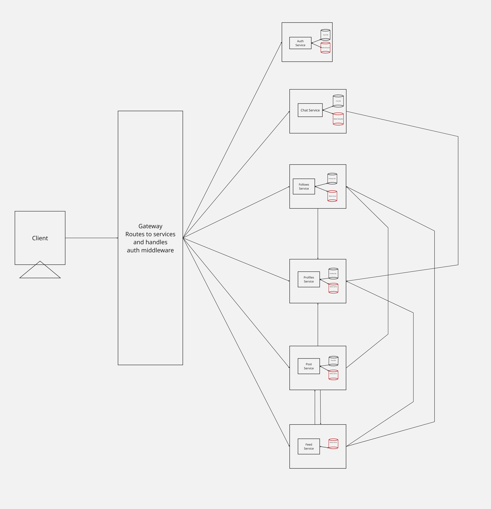

ConnectSphere:
 Real-Time Social Engine & Messaging PlatformA high-performance, full-stack social networking and messaging platform. 

 Live Demo : https://insta-sys-des-backend.vercel.app/
 
This project utilizes a modular monolithic backend architecture, combining a RESTful API with a stateful WebSocket gateway to handle social graphs, dynamic activity feeds, and zero-loss real-time chat.

FOR SYSTEM DESIGN: check out /backend/Designs

[API Documentation](backend/Designs/apiDoc.pdf)
[SRS](<backend/Designs/Software Requirements Specification.pdf>)

✨ Key Features
Hybrid Real-Time Chat Engine: Direct Messages (DMs) and multi-tenant Group Chats using a dual-protocol architecture. Messages are written durably to PostgreSQL via HTTP before broadcasting to active clients via Socket.IO.

Granular Delivery Tracking: Real-time state mutations for messaging (Sent, Delivered, Read) with dynamic broadcast revocation when users leave a thread.

High-Throughput Feed Generation: Dynamic activity feeds aggregated from complex social graphs (follower/following matrices) using optimized PostgreSQL LATERAL joins and CASE conditionals.

Cursor-Based Pagination: $O(1)$ lookup complexity for infinite scrolling across feeds and chat histories, preventing database degradation at scale.

Zero-Trust Security & Auth: Stateless JWT authentication delivered exclusively via HttpOnly, Secure cookies, guarding both HTTP endpoints and WebSocket handshakes.

Automated Data Integrity: PostgreSQL-level triggers automatically provision user profiles during registration, preventing orphaned records.

Rich-Media Distribution: Middleware-driven file upload pipelines for profile avatars and post media assets.

🛠 Tech Stack

Backend EngineRuntime: Node.js (v20+)Framework: Express.js (TypeScript)Real-Time Gateway: Socket.IOSecurity: bcrypt, jsonwebtoken, cookie-parserData & InfrastructurePrimary Database: PostgreSQL (Relational data, Transactions, Triggers)In-Memory Cache : Redis (Feed caching, active socket state)

Frontend ApplicationFramework: React (Vite)Styling: Tailwind CSS (Dark-mode optimized)Real-Time Client: socket.io-client

📂 Project StructurePlaintext.
├── /backend            # Node.js/Express modular monolith
│   ├── /src
│   │   ├── /modules    # auth, chat, feed, follow, post, profile
│   │   ├── /config     # DB, Redis, and WebSocket connections
│   │   ├── /middleware # JWT validation, Multer file uploads
│   │   └── app.ts      # Express & Socket.IO unified server bootstrap
│   ├── /uploads        # Static directory for media assets
│   └── package.json
└── /frontend           # React UI and client-side integration
    ├── /src
    │   ├── /pages      # Feed, Inbox, Profile views
    │   └── /services   # API and Socket connection logic
    └── package.json

🚀 Local Setup & Installation
1. Prerequisites
Ensure you have the following installed on your machine:Node.js (v20 or higher)PostgreSQL (v15 or higher)Redis Server (v7 or higher, running locally on port 6379)

2. Database SetupCreate a local PostgreSQL database (e.g., social_network_db). Then, execute your schema migrations to create the tables (users, profiles, posts, follows, conversations, messages, etc.).Crucial: Run the automated profile creation trigger in your SQL console so profiles generate instantly upon signup:SQLCREATE OR REPLACE FUNCTION create_profile_for_new_user()
RETURNS TRIGGER AS $$
BEGIN
  INSERT INTO profiles (user_id, username, display_name) 
  VALUES (NEW.id, NEW.username, NEW.username);
  RETURN NEW;
END;
$$ LANGUAGE plpgsql;

CREATE TRIGGER trigger_create_profile_after_signup
AFTER INSERT ON users
FOR EACH ROW EXECUTE FUNCTION create_profile_for_new_user();

3. Environment VariablesNavigate to the /backend directory, copy the example environment file, and fill in your database credentials:Bashcd backend

cp .env.example .env
(Ensure your .env includes your Postgres credentials, Redis host, JWT secret, and Client Origin for CORS).4. Install DependenciesOpen two separate terminal windows—one for the frontend and one for the backend—and install the dependencies:Terminal 1 (Backend):Bashcd backend
npm install
Terminal 2 (Frontend):Bashcd frontend
npm install
💻 Running the ApplicationOnce dependencies are installed and Redis/PostgreSQL are running locally, start both development servers.Terminal 1 (Backend):Bash# Starts the Express and Socket.IO server on the port defined in your .env (e.g., 3000)
npm run dev
Terminal 2 (Frontend):Bash# Starts the React Vite development server (usually on port 5173)
npm run dev
The application is now live! Open your browser to the URL provided by the frontend terminal (e.g., http://localhost:5173) to sign up your first user.
